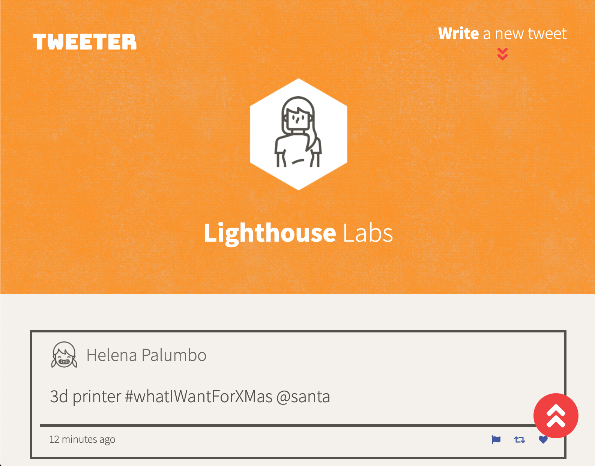
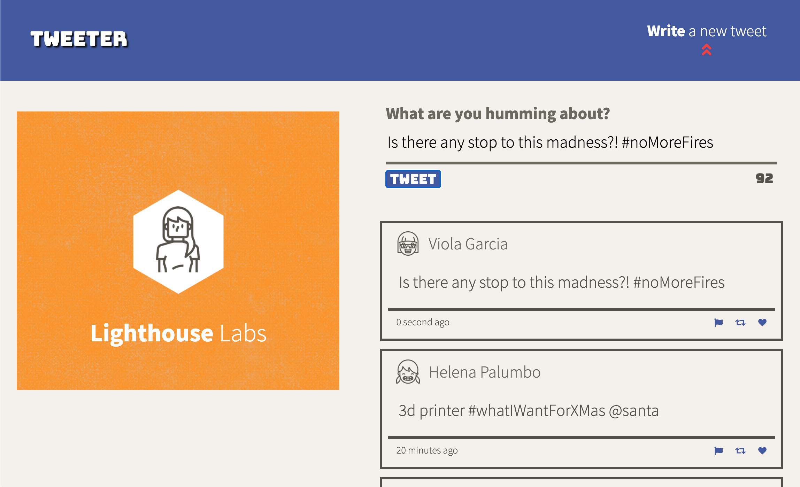

# Tweeter Project

Tweeter is a simple, responsive, single-page Twitter clone made as part of the Lighthouse coding bootcamp. The project involved the use of HTML, CSS, JS, jQuery and AJAX front-end skills, as well as Node and Express back-end skills.

## Screenshots

## Getting Started

1. Install dependencies using the `npm install` command.
2. Start the web server using the `npm run local` command. The app will be served at <http://localhost:8080/>.
3. Go to <http://localhost:8080/> in your browser.

## Dependencies

- Express
- Node 5.10.x or above